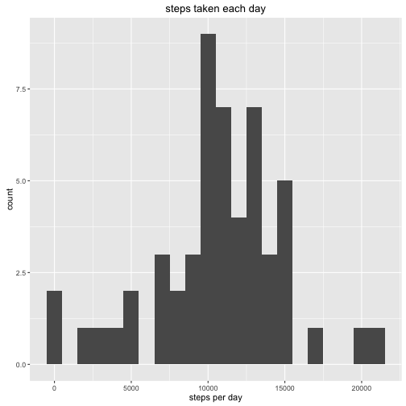
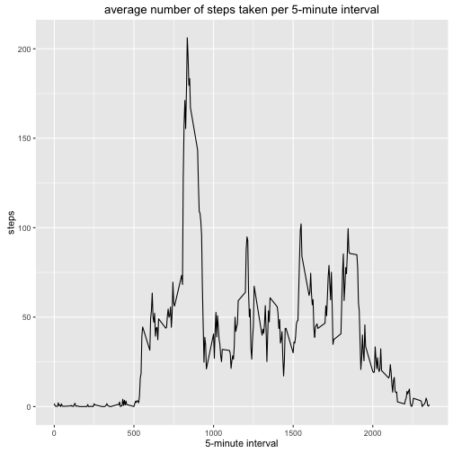
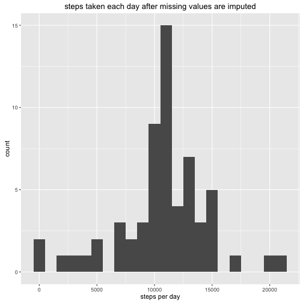
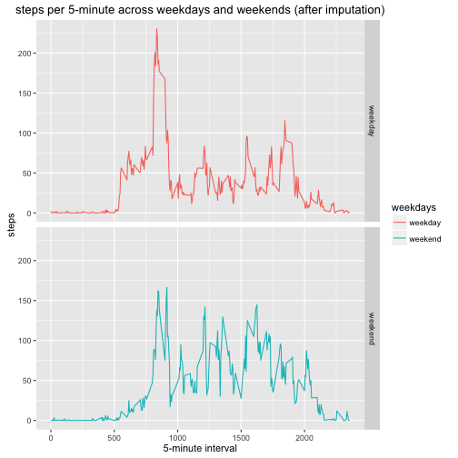

## Introduction
This assignment makes use of data from a personal activity monitoring device. This device collects data at 5 minute intervals through out the day. The data consists of two months of data from an anonymous individual collected during the months of October and November, 2012 and include the number of steps taken in 5 minute intervals each day.
The data for this assignment can be downloaded from the course web site:

Dataset: [Activity monitoring data [52K]](https://d396qusza40orc.cloudfront.net/repdata%2Fdata%2Factivity.zip)
The variables included in this dataset are:

steps: Number of steps taking in a 5-minute interval (missing values are coded as 𝙽𝙰)
date: The date on which the measurement was taken in YYYY-MM-DD format
interval: Identifier for the 5-minute interval in which measurement was taken
The dataset is stored in a comma-separated-value (CSV) file and there are a total of 17,568 observations in this dataset.


## Read the dataset


```r
library(dplyr)
library(ggplot2)
act<-read.csv("activity.csv")
head(act)
```

```
##   steps       date interval
## 1    NA 2012-10-01        0
## 2    NA 2012-10-01        5
## 3    NA 2012-10-01       10
## 4    NA 2012-10-01       15
## 5    NA 2012-10-01       20
## 6    NA 2012-10-01       25
```

## Histogram of the total number of steps taken each day

The missing value of `act` dataset is ignored.Then the total numbers of steps for each day are calculated.

```r
act_noNA<-filter(act,!is.na(steps))
bydate<-group_by(act_noNA,date)
act1<-as.data.frame(summarize(bydate,sum(steps)))
names(act1)<-c("date","total_steps")
head(act1)
```

```
##         date total_steps
## 1 2012-10-02         126
## 2 2012-10-03       11352
## 3 2012-10-04       12116
## 4 2012-10-05       13294
## 5 2012-10-06       15420
## 6 2012-10-07       11015
```

```r
ggplot(act1,aes(total_steps))+geom_histogram(binwidth = 1000)+xlab("steps per day")+ggtitle("steps taken each day")
```



## Mean and median number of steps taken each day


```r
act_mean<-mean(act1$total_steps)
act_mean
```

```
## [1] 10766.19
```

```r
act_median<-median(act1$total_steps)
act_median
```

```
## [1] 10765
```

## Time series plot of the average number of steps taken
A time series plot of the 5-minute interval (x-axis) and the average number of steps taken, averaged across all days (y-axis).

```r
byinterval<-group_by(act_noNA,interval)
act2<-as.data.frame(summarize(byinterval,mean(steps)))
names(act2)<-c("Interval","Averaged_steps")
ggplot(act2,aes(Interval,Averaged_steps))+geom_line()+ggtitle("average number of steps taken per 5-minute interval")+xlab("5-minute interval")+ylab("steps")
```



## The 5-minute interval that, on average, contains the maximum number of steps


```r
act2$Interval[which.max(act2$Averaged_steps)]
```

```
## [1] 835
```

## Use mean for that 5-minute interval to impute missing values
Missing values are replaced with mean of the corresponding 5-minute interval calculated by ingoring the missing values.

```r
sum(is.na(act$steps))
```

```
## [1] 2304
```

```r
act_impute<-act
for (i in 1:nrow(act_impute)){
if(is.na(act_impute$steps[i])){
  act_impute$steps[i]<-act2$Averaged_steps[match(act_impute$interval[i],act2$Interval)]
}
}
head(act_impute)
```

```
##       steps       date interval
## 1 1.7169811 2012-10-01        0
## 2 0.3396226 2012-10-01        5
## 3 0.1320755 2012-10-01       10
## 4 0.1509434 2012-10-01       15
## 5 0.0754717 2012-10-01       20
## 6 2.0943396 2012-10-01       25
```

##Histogram of the total number of steps taken each day after missing values are imputed


```r
imputebydate<-group_by(act_impute,date)
act_impute1<-as.data.frame(summarize(imputebydate,sum(steps)))
names(act_impute1)<-c("date","total_steps")
ggplot(act_impute1,aes(total_steps))+geom_histogram(binwidth = 1000)+xlab("steps per day")+ggtitle("steps taken each day after missing values are imputed")
```



##Panel plot comparing the average number of steps taken per 5-minute interval across weekdays and weekends


```r
act_impute$weekdays<-weekdays(as.Date(act_impute$date))
act_impute<-mutate(act_impute,weekdays=ifelse(weekdays=="Saturday"|weekdays=="Sunday","weekend","weekday"))
head(act_impute)
```

```
##       steps       date interval weekdays
## 1 1.7169811 2012-10-01        0  weekday
## 2 0.3396226 2012-10-01        5  weekday
## 3 0.1320755 2012-10-01       10  weekday
## 4 0.1509434 2012-10-01       15  weekday
## 5 0.0754717 2012-10-01       20  weekday
## 6 2.0943396 2012-10-01       25  weekday
```

```r
byintervalweekday<-group_by(act_impute,interval,weekdays)
act_impute2<-as.data.frame(summarize(byintervalweekday,mean(steps)))
ggplot(act_impute2,aes(interval,`mean(steps)`,colour=weekdays))+geom_line()+facet_grid(weekdays~.)+ggtitle("steps per 5-minute across weekdays and weekends (after imputation)")+xlab("5-minute interval")+ylab("steps")
```




